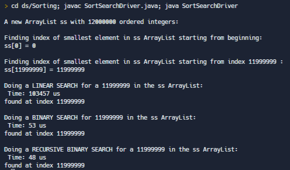

# Welcome to Joel Bianchi's Hunter CS Portfolio

## Intro to Programming in a High-Level Language

## Data Structures
#### 
Compare the time differences between different searching algorithms:

* [Link to SearchSort Code](https://github.com/hunter-teacher-cert/cohort-3-summer-work-JABianchi/blob/master/ds/Sorting/SortSearchDriver.java)

## CS Teaching Methods I

